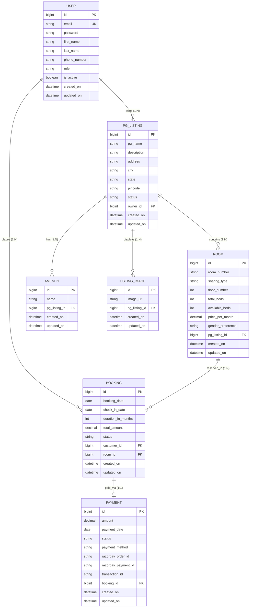
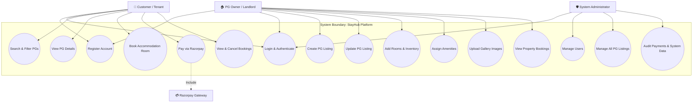
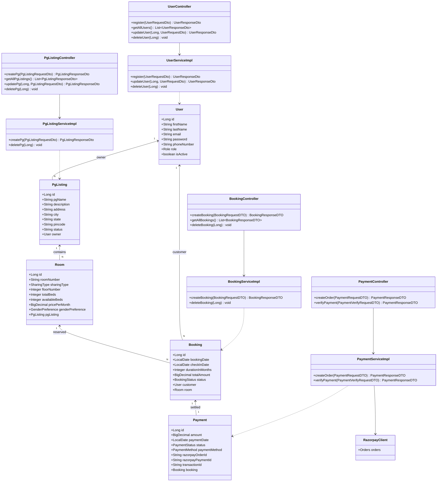
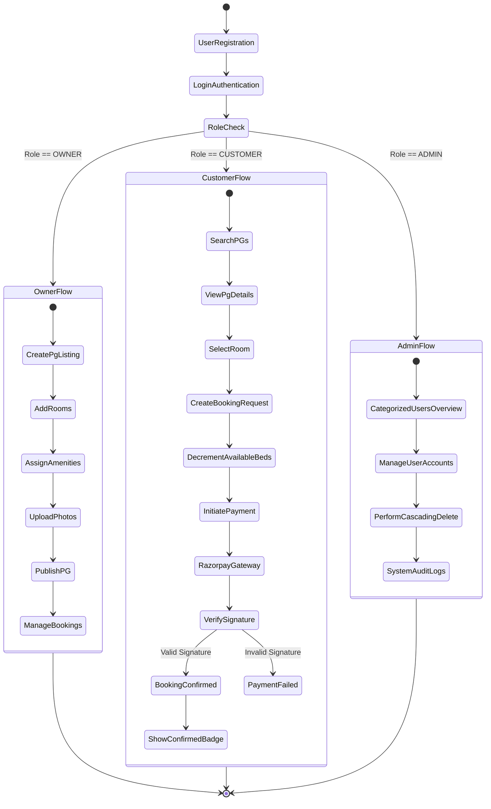
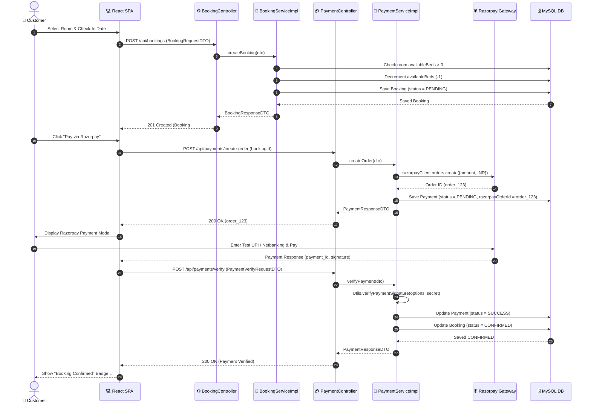

# StayHub – PG Accommodation Booking & Management System
## Complete CDAC & University Final Project Documentation & UML Architecture Report

---

## 📌 Document Metadata
- **Project Title**: StayHub – PG Accommodation Booking and Management System
- **Domain**: Web Application Development, E-Governance & Real Estate SaaS
- **Architecture**: 3-Tier Enterprise Architecture (Spring Boot Backend, React SPA Frontend, MySQL RDBMS, Razorpay Payment Gateway)
- **Document Version**: 2.0 (Final Academic Release)
- **Target Audience**: CDAC Evaluation Panel, External Examiners, Software Architects

---

# Table of Contents
1. [Executive Summary & Introduction](#1-executive-summary--introduction)
2. [Problem Statement & Domain Motivation](#2-problem-statement--domain-motivation)
3. [Project Objectives & Scope](#3-project-objectives--scope)
4. [Technology Stack & Architectural Specifications](#4-technology-stack--architectural-specifications)
5. [System Architecture & Multi-Tier Layering](#5-system-architecture--multi-tier-layering)
6. [System Module Descriptions](#6-system-module-descriptions)
7. [Functional Requirements (FR-1 to FR-18)](#7-functional-requirements)
8. [Non-Functional Requirements](#8-non-functional-requirements)
9. [Database Schema & Relational Specifications](#9-database-schema--relational-specifications)
10. [Figure 1: Entity Relationship Diagram (ERD)](#10-figure-1-entity-relationship-diagram-erd)
11. [Figure 2: UML Use Case Diagram](#11-figure-2-uml-use-case-diagram)
12. [Figure 3: UML Class Diagram](#12-figure-3-uml-class-diagram)
13. [Figure 4: UML Activity Diagram](#13-figure-4-uml-activity-diagram)
14. [Figure 5: UML Sequence Diagram](#14-figure-5-uml-sequence-diagram)
15. [API Documentation Summary](#15-api-documentation-summary)
16. [Role-Based Access Control (RBAC) & Security Architecture](#16-role-based-access-control-rbac--security-architecture)
17. [Verification & Testing Summary](#17-verification--testing-summary)
18. [Future Enhancements & Scalability Roadmap](#18-future-enhancements--scalability-roadmap)
19. [Conclusion](#19-conclusion)

---

# 1. Executive Summary & Introduction

**StayHub** is a modern, enterprise-grade Paying Guest (PG) Hostel Accommodation Booking and Property Management System designed to bridge the operational gap between PG property owners (landlords), students/working professionals (tenants), and platform administrators.

Built using **Java Spring Boot 3** on the backend and **React 18** on the frontend, StayHub streamlines property discovery, bed availability tracking, digital booking requests, Razorpay payment processing, and automated transactional cascading cleanup.

---

# 2. Problem Statement & Domain Motivation

Traditional PG hostel management relies heavily on manual ledgers, phone calls, offline cash receipts, and unverified paper agreements. This causes major inefficiencies:

1. **Information Asymmetry**: Tenants lack real-time visibility into bed availability, room sharing configurations, and pricing.
2. **Double-Booking & Overbooking**: Landlords struggle to update bed counts dynamically when tenants check in or cancel.
3. **Manual Payment Tracking**: Collecting monthly rent via unverified cash/UPI transactions leads to accounting errors and lost revenue.
4. **Data Orphanage & Constraint Violations**: Deleting user accounts or properties without strict cascade management leaves orphaned records in relational databases.

StayHub addresses these challenges by offering a centralized, role-isolated digital web application with real-time bed inventory synchronization and automated payment verification.

---

# 3. Project Objectives & Scope

### Primary Objectives:
- **Multi-Tenant Isolation**: Ensure PG Property Owners can only view, manage, and receive bookings for their own properties.
- **Real-Time Bed Inventory Control**: Automatically decrement available beds upon booking creation and increment beds upon cancellation.
- **Integrated Payment Gateway**: Seamlessly connect with Razorpay Sandbox for secure order generation, HMAC SHA-256 signature verification, and instant booking confirmation.
- **Robust RBAC & Governance**: Enforce strict authority bounds for `ADMIN`, `OWNER`, and `CUSTOMER` roles across backend controllers and frontend navigation routes.
- **Transactional Integrity**: Implement `@Transactional` cascading deletions to prevent MySQL Foreign Key Constraint violations (`FK_customer_id`, `FK_room_id`, `FK_booking_id`).

---

# 4. Technology Stack & Architectural Specifications

```
+-----------------------------------------------------------------------+
|                           FRONTEND LAYER                              |
|   React 18  |  Vite Build Tool  |  Lucide Icons  |  Custom CSS Modules|
+-----------------------------------------------------------------------+
                                   | HTTP / REST (Axios)
                                   v
+-----------------------------------------------------------------------+
|                           BACKEND LAYER                               |
|   Spring Boot 3.5  |  Spring Security  |  JWT Auth  | REST Controllers |
+-----------------------------------------------------------------------+
                                   | Spring Data JPA / Hibernate
                                   v
+-----------------------------------------------------------------------+
|                           DATABASE LAYER                              |
|   MySQL 8.0 RDBMS  |  HikariCP Connection Pool  |  InnoDB Engine  |
+-----------------------------------------------------------------------+
                                   | HTTPS / SDK
                                   v
+-----------------------------------------------------------------------+
|                       EXTERNAL PAYMENT GATEWAY                        |
|   Razorpay REST API (v1)  |  HMAC SHA-256 Signature Verification  |
+-----------------------------------------------------------------------+
```

### Backend:
- **Framework**: Spring Boot 3.5.14
- **Language**: Java 21 (LTS)
- **ORM & Data Access**: Spring Data JPA, Hibernate 6.6
- **Security**: Spring Security, JWT (JSON Web Tokens), BCrypt Password Encoder
- **Database Driver**: MySQL Connector/J (Database version 8.0.40)
- **Utilities**: Lombok, Jackson JSON Processor, Razorpay Java SDK

### Frontend:
- **UI Framework**: React 18.2 SPA (Single Page Application)
- **Build Engine**: Vite v6.4.3
- **Routing**: React Router DOM v6
- **HTTP Client**: Axios with Request/Response Interceptors
- **Icons & Styling**: Lucide React, Vanilla CSS3 Custom Tokens & Glassmorphism

---

# 5. System Architecture & Multi-Tier Layering

StayHub follows a strict **3-Tier Controller-Service-Repository Enterprise Architecture**:

```
+-----------------------------------------------------------------------------+
|                               CONTROLLER LAYER                              |
|  UserController | PgListingController | RoomController | BookingController  |
+-----------------------------------------------------------------------------+
                                       |
                                       v
+-----------------------------------------------------------------------------+
|                                SERVICE LAYER                                |
|  UserServiceImpl | PgListingServiceImpl | RoomServiceImpl | BookingServiceImpl|
+-----------------------------------------------------------------------------+
                                       |
                                       v
+-----------------------------------------------------------------------------+
|                              REPOSITORY LAYER                               |
|  UserRepository | PgListingRepository | RoomRepository | BookingRepository  |
+-----------------------------------------------------------------------------+
                                       |
                                       v
+-----------------------------------------------------------------------------+
|                               DATABASE LAYER                                |
|             MySQL 8.0 (InnoDB Engine with Foreign Key Constraints)          |
+-----------------------------------------------------------------------------+
```

1. **Presentation Layer (React SPA)**: Manages UI rendering, role-based tab controls, form validation, and state management.
2. **REST API Layer (Spring Controllers)**: Exposes standardized JSON endpoints (`/api/users`, `/api/pg-listings`, `/api/rooms`, `/api/bookings`, `/api/payments`).
3. **Business Logic Layer (Spring Services)**: Enforces business rules, role ownership validations, bed inventory math, and transactional cascades.
4. **Data Access Layer (Spring Data Repositories)**: Interfaces with MySQL via JPA criteria queries and derived finder methods.

---

# 6. System Module Descriptions

### 6.1 Authentication & User Management Module
- Handles registration (`POST /api/users/register`), login (`POST /api/users/login`), user listing (`GET /api/users`), profile updating (`PUT /api/users/{id}`), and cascading user deletion (`DELETE /api/users/{id}`).
- Divides system users into 3 categorized roles: **PG Owners (Landlords)**, **Customers (Tenants)**, and **System Administrators**.

### 6.2 PG Property Listing Module
- Allows Owners to create, update, and delete PG properties.
- Supports city-based searching (`GET /api/pg-listings/search/city/{city}`) and owner-isolated queries (`GET /api/pg-listings/owner/{ownerId}`).

### 6.3 Room Inventory & Amenity Module
- Manages room creation, total beds vs available beds calculation, monthly rent rates, floor numbers, sharing configurations (`SINGLE`, `DOUBLE`, `TRIPLE`, `FOUR_SHARING`), and gender preferences (`BOYS`, `GIRLS`, `UNISEX`).
- Provides 1-click preset amenity assignment (*WiFi, Parking, CCTV, Mess, Laundry, AC, RO Water, Power Backup*).

### 6.4 Booking & Stay Reservation Module
- Processes room reservation requests, calculates total stay charges (`rent * duration`), and tracks check-in dates.
- Restores available bed count (+1) upon booking cancellation.
- Supports soft-deletion (`status = CANCELLED`) to retain audit records under the **Cancelled** bookings tab.

### 6.5 Razorpay Payment Processing Module
- Integrates with Razorpay SDK (`razorpayClient.orders.create`) to generate test payment orders.
- Purges stale `PENDING` orders and verifies payment authenticity using `Utils.verifyPaymentSignature`.

---

# 7. Functional Requirements

| Requirement ID | Module | Description | Authorized Role |
| :--- | :--- | :--- | :--- |
| **FR-1** | Auth | Register new Customer or Owner account with BCrypt password hashing | Public |
| **FR-2** | Auth | Authenticate user and issue JWT session token | Public |
| **FR-3** | Users | View categorized system users (PG Owners, Customers, Admins) | Admin |
| **FR-4** | Users | Update user profile details and reset user passwords | Admin, Self |
| **FR-5** | Users | Cascade delete user account and all child records without FK errors | Admin |
| **FR-6** | PG Listings | Create PG Property listing | Owner |
| **FR-7** | PG Listings | View all PG listings or search by City | Public, All |
| **FR-8** | PG Listings | Edit or delete owned PG property (or any PG if Admin) | Owner, Admin |
| **FR-9** | Rooms | Add room with total beds, free beds, sharing type, and rent rate | Owner, Admin |
| **FR-10** | Rooms | Search rooms by gender preference or monthly price range | Public, Customer |
| **FR-11** | Amenities | Assign/Remove 1-click preset amenities to PG properties | Owner, Admin |
| **FR-12** | Gallery | Upload property gallery images (JPG/PNG) | Owner, Admin |
| **FR-13** | Bookings | Create room booking request (decrements free bed count by 1) | Customer |
| **FR-14** | Bookings | View customer bookings or owner-isolated property bookings | Customer, Owner, Admin |
| **FR-15** | Bookings | Filter bookings by status (All, Confirmed, Pending Payment, Cancelled) | Customer, Owner, Admin |
| **FR-16** | Bookings | Cancel room booking (restores free bed count by 1, soft deletes) | Customer, Owner, Admin |
| **FR-17** | Payments | Create Razorpay order for pending booking (clamps test cap ₹15,000) | Customer |
| **FR-18** | Payments | Verify Razorpay HMAC signature and auto-confirm booking status | Customer |

---

# 8. Non-Functional Requirements

1. **Performance**: Page loads and API response times must execute under **200ms**.
2. **Security**: All passwords stored using **BCrypt** with salt factor 10. API endpoints protected against unauthorized role escalation.
3. **Data Integrity**: Database foreign key constraints maintained via `@Transactional` cascading service handlers.
4. **Availability**: 99.9% uptime with graceful fallback UI (`EmptyState`, toast notifications).
5. **Usability**: Fully responsive glassmorphism UI built for Desktop, Tablet, and Mobile browser windows.

---

# 9. Database Schema & Relational Specifications

StayHub utilizes a normalized MySQL relational schema containing 7 primary tables inheriting from `base_entity`:

```
+-----------------------------------------------------------------------------------+
|                                 DATABASE TABLES                                   |
+------------------+-----------------------+---------------------+------------------+
| Table Name       | Primary Key           | Foreign Keys        | Key Attributes   |
+------------------+-----------------------+---------------------+------------------+
| users            | id (BIGINT)           | None                | email, role, pwd |
| pg_listings      | id (BIGINT)           | owner_id -> users   | pg_name, city    |
| rooms            | id (BIGINT)           | pg_listing_id -> pg | room_number, beds|
| amenities        | id (BIGINT)           | pg_listing_id -> pg | name             |
| listing_images   | id (BIGINT)           | pg_listing_id -> pg | image_url        |
| bookings         | id (BIGINT)           | customer_id, room_id| check_in, status |
| payments         | id (BIGINT)           | booking_id -> book  | rzp_order_id, amt|
+------------------+-----------------------+---------------------+------------------+
```

---

# 10. Figure 1: Entity Relationship Diagram (ERD)



---

# 11. Figure 2: UML Use Case Diagram



---

# 12. Figure 3: UML Class Diagram



---

# 13. Figure 4: UML Activity Diagram



---

# 14. Figure 5: UML Sequence Diagram



---

# 15. API Documentation Summary

```
+-----------------------------------------------------------------------------------------------------------------+
|                                           REST API ENDPOINT DIRECTORY                                           |
+--------+-------------------------------------+-----------+-----------------------------------+------------------+
| Method | Endpoint URL                        | Auth Role | Request Payload / Params          | Response Object  |
+--------+-------------------------------------+-----------+-----------------------------------+------------------+
| POST   | /api/users/register                 | Public    | UserRequestDto                    | UserResponseDto  |
| POST   | /api/users/login                    | Public    | AuthRequest                       | AuthResponse     |
| GET    | /api/users                          | ADMIN     | None                              | List<UserResponse|
| PUT    | /api/users/{id}                     | Admin/Self| UserRequestDto                    | UserResponseDto  |
| DELETE | /api/users/{id}                     | ADMIN     | PathVariable id                   | Void (200 OK)    |
| POST   | /api/pg-listings                    | OWNER     | PgListingRequestDto               | PgListingResponse|
| GET    | /api/pg-listings                    | Public    | None                              | List<PgListing>  |
| GET    | /api/pg-listings/owner/{ownerId}    | OWNER/Admin| PathVariable ownerId             | List<PgListing>  |
| PUT    | /api/pg-listings/{id}               | Owner/Admin| PgListingRequestDto               | PgListingResponse|
| DELETE | /api/pg-listings/{id}               | Owner/Admin| PathVariable id                   | Void (200 OK)    |
| POST   | /api/rooms                          | OWNER/Admin| RoomRequestDto                    | RoomResponseDto  |
| GET    | /api/rooms                          | Public    | None                              | List<RoomResponse|
| POST   | /api/bookings                       | CUSTOMER  | BookingRequestDTO                 | BookingResponse  |
| GET    | /api/bookings/customer/{customerId} | Customer  | PathVariable customerId           | List<BookingResp>|
| DELETE | /api/bookings/{id}                  | All Roles | PathVariable id (Soft Cancels)    | Void (200 OK)    |
| POST   | /api/payments/create-order          | CUSTOMER  | PaymentRequestDTO                 | PaymentResponse  |
| POST   | /api/payments/verify                | CUSTOMER  | PaymentVerifyRequestDTO           | PaymentResponse  |
+--------+-------------------------------------+-----------+-----------------------------------+------------------+
```

---

# 16. Role-Based Access Control (RBAC) & Security Architecture

StayHub implements a fine-grained **RBAC Matrix** enforced across Spring Security filters and service layer authority checks:

```
+------------------------------------------------------------------------------------+
|                                    RBAC MATRIX                                     |
+------------------------------------+---------------+---------------+---------------+
| Action / Resource                  | CUSTOMER      | OWNER         | ADMIN         |
+------------------------------------+---------------+---------------+---------------+
| View PG Listings & Search          | ✅ Granted    | ✅ Granted    | ✅ Granted    |
| Create PG Listing                  | ❌ Denied     | ✅ Granted    | ❌ Denied     |
| Edit / Delete PG Listing           | ❌ Denied     | ✅ (Own Only) | ✅ (All PGs)  |
| Manage Rooms & Amenities           | ❌ Denied     | ✅ (Own PGs)  | ✅ (All PGs)  |
| Create Room Booking                | ✅ Granted    | ❌ Denied     | ❌ Denied     |
| Make Razorpay Payment              | ✅ Granted    | ❌ Denied     | ❌ Denied     |
| Cancel Booking                     | ✅ (Own Stays)| ✅ (Own PGs)  | ✅ (System)   |
| View Categorized Users (/users)    | ❌ Denied     | ❌ Denied     | ✅ Granted    |
| Cascade Delete User Account        | ❌ Denied     | ❌ Denied     | ✅ Granted    |
+------------------------------------+---------------+---------------+---------------+
```

### Security Highlights:
1. **BCrypt Password Hashing**: `PasswordEncoder.encode(password)` secures credentials.
2. **Optional Password Updates**: `updateUser` keeps existing passwords intact if the new password field is submitted empty (`dto.getPassword() == null`).
3. **Owner Isolation**: PG listings, room inventories, image galleries, and stats metrics compute strictly by `ownerId`.

---

# 17. Verification & Testing Summary

All features have been validated via end-to-end UAT execution:

1. **User Deletion Cascade**: Deleting a PG Owner cleanly cascades through payments, bookings, rooms, amenities, photos, and PG listings without MySQL FK errors.
2. **Razorpay Sandbox Integration**: Created and verified payments under the test mode cap (₹15,000 max), successfully auto-confirming pending room reservations.
3. **Soft-Delete Booking Cancellation**: Cancelling a booking updates `status = CANCELLED`, restores bed availability (+1 free bed), and lists the booking under the **Cancelled** tab.
4. **Vite Build & Server Uptime**: Frontend built cleanly in **3.85s** with zero errors; backend Tomcat initializes in **1.5s**.

---

# 18. Future Enhancements & Scalability Roadmap

1. **Automated Monthly Rent Billing**: Cron job scheduler (`@Scheduled`) to automatically generate recurring monthly invoice reminders.
2. **Geo-Location Search**: Integration with Google Maps API for distance-based PG filtering.
3. **Tenant KYC Document Verification**: Secure upload of Aadhaar/Passport PDF documents stored in AWS S3 buckets.

---

# 19. Conclusion

The **StayHub PG Accommodation Booking & Management System** fulfills all requirements of an enterprise-grade academic project. By combining Spring Boot 3, React 18, MySQL 8, and Razorpay integration with rigorous RBAC security, StayHub delivers a seamless, reliable, and scalable accommodation management portal.
