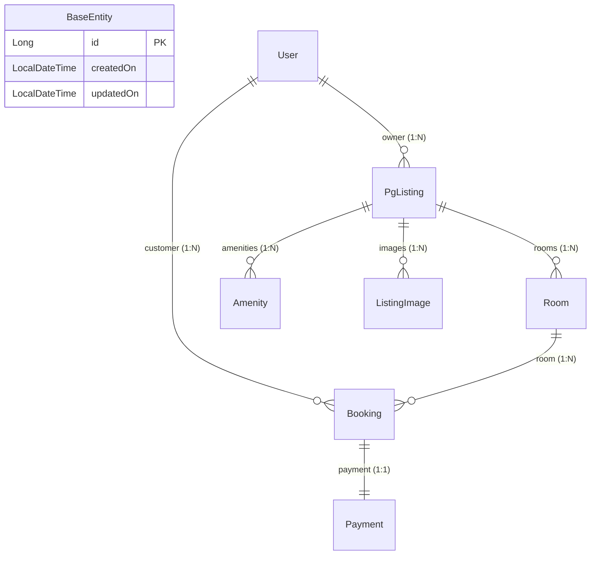

# StayHub Backend: Entity Mappings, Database Architecture & Interview Guide

---

## 1. Executive Summary & Tech Stack Overview

The **StayHub** backend is built on **Spring Boot**, **Spring Data JPA**, and **Hibernate ORM**. The persistence layer models a Paying Guest (PG) accommodation management system handling Users, PG Listings, Rooms, Amenities, Images, Bookings, and Payments.

* **Package Location**: `com.stayhub.entity`
* **Base Architecture**: `@MappedSuperclass` inheritance via [`BaseEntity`](file:///f:/CDACProj/CDAC_PROJECT_KD_J028-main/spring_boot_backend_template/src/main/java/com/stayhub/entity/BaseEntity.java)
* **Primary Key Strategy**: `GenerationType.IDENTITY` (Auto-increment `Long`)
* **Relationship Pattern**: Unidirectional `@ManyToOne` and `@OneToOne` child-to-parent associations
* **Enum Mapping**: `EnumType.STRING` across all enums

---

## 2. Base Entity & Auditing

### [`BaseEntity.java`](file:///f:/CDACProj/CDAC_PROJECT_KD_J028-main/spring_boot_backend_template/src/main/java/com/stayhub/entity/BaseEntity.java)
All domain entities inherit from `BaseEntity`.

* **JPA Annotation**: `@MappedSuperclass` (does not create a separate database table).
* **Fields**:
  * `id` (`Long`): `@Id`, `@GeneratedValue(strategy = GenerationType.IDENTITY)`
  * `createdOn` (`LocalDateTime`): `@CreationTimestamp` (Auto-populated on SQL `INSERT`)
  * `updatedOn` (`LocalDateTime`): `@UpdateTimestamp` (Auto-populated on SQL `UPDATE`)

---

## 3. Comprehensive Entity Mapping Breakdown

### 3.1. [`User`](file:///f:/CDACProj/CDAC_PROJECT_KD_J028-main/spring_boot_backend_template/src/main/java/com/stayhub/entity/User.java) Entity
* **Table**: `users`
* **Role**: Represents registered users across roles (`ROLE_CUSTOMER`, `ROLE_OWNER`, `ROLE_ADMIN`).

| Field | Type | JPA Column Annotations | Description / Notes |
| :--- | :--- | :--- | :--- |
| `firstName` | `String` | `@Column(nullable = false, length = 50)` | User's first name |
| `lastName` | `String` | `@Column(nullable = false, length = 50)` | User's last name |
| `email` | `String` | `@Column(nullable = false, unique = true, length = 100)` | Unique account login email |
| `password` | `String` | `@Column(nullable = false)` | Encrypted password string |
| `phoneNumber` | `String` | `@Column(nullable = false, unique = true, length = 15)` | Unique contact number |
| `role` | `Role` | `@Enumerated(EnumType.STRING), @Column(nullable = false)` | Enum (`com.stayhub.enums.Role`) |
| `isActive` | `Boolean` | `@Column(nullable = false)` | Soft-delete flag (default = `true`) |

---

### 3.2. [`PgListing`](file:///f:/CDACProj/CDAC_PROJECT_KD_J028-main/spring_boot_backend_template/src/main/java/com/stayhub/entity/PgListing.java) Entity
* **Table**: `pg_listings`
* **Role**: Represents a PG property owned by a landlord (`User`).

| Field / Relationship | Type | JPA Annotations | Description / Notes |
| :--- | :--- | :--- | :--- |
| `pgName` | `String` | `@Column(nullable = false, length = 100)` | Name of the PG listing |
| `description` | `String` | `@Column(nullable = false, columnDefinition = "TEXT")` | Long text description |
| `address` | `String` | `@Column(nullable = false)` | Street address |
| `city` | `String` | `@Column(nullable = false, length = 50)` | City |
| `state` | `String` | `@Column(nullable = false, length = 50)` | State |
| `pincode` | `String` | `@Column(nullable = false, length = 10)` | Postal pincode |
| `status` | `PgStatus` | `@Enumerated(EnumType.STRING), @Column(nullable = false)` | Enum (`PgStatus`: PENDING, APPROVED, etc.) |
| **`owner`** | `User` | **`@ManyToOne`**   `@JoinColumn(name = "owner_id", nullable = false)` | Foreign key referencing `users(id)` |

---

### 3.3. [`Room`](file:///f:/CDACProj/CDAC_PROJECT_KD_J028-main/spring_boot_backend_template/src/main/java/com/stayhub/entity/Room.java) Entity
* **Table**: `rooms`
* **Table Constraint**: `@UniqueConstraint(columnNames = {"room_number", "pg_listing_id"})`

| Field / Relationship | Type | JPA Annotations | Description / Notes |
| :--- | :--- | :--- | :--- |
| `roomNumber` | `String` | `@Column(nullable = false, length = 20)` | Room number code (e.g. "101") |
| `floorNumber` | `Integer` | `@Column(nullable = false)` | Floor level |
| `genderPreference` | `GenderPreference`| `@Enumerated(EnumType.STRING), @Column(nullable = false)` | Enum (MALE, FEMALE, UNISEX) |
| `sharingType` | `SharingType` | `@Enumerated(EnumType.STRING), @Column(nullable = false)` | Enum (SINGLE, DOUBLE, TRIPLE, etc.) |
| `pricePerMonth` | `BigDecimal` | `@Column(nullable = false, precision = 10, scale = 2)` | Monthly rate in `DECIMAL(10,2)` |
| `totalBeds` | `Integer` | `@Column(nullable = false)` | Maximum bed capacity |
| `availableBeds` | `Integer` | `@Column(nullable = false)` | Currently available beds |
| **`pgListing`** | `PgListing` | **`@ManyToOne`**   `@JoinColumn(name = "pg_listing_id", nullable = false)` | Foreign key referencing `pg_listings(id)` |

---

### 3.4. [`Amenity`](file:///f:/CDACProj/CDAC_PROJECT_KD_J028-main/spring_boot_backend_template/src/main/java/com/stayhub/entity/Amenity.java) Entity
* **Table**: `amenities`

| Field / Relationship | Type | JPA Annotations | Description / Notes |
| :--- | :--- | :--- | :--- |
| `name` | `String` | `@Column(nullable = false, length = 50)` | Name of amenity (e.g., "WiFi", "AC") |
| **`pgListing`** | `PgListing` | **`@ManyToOne`**   `@JoinColumn(name = "pg_listing_id", nullable = false)` | Foreign key referencing `pg_listings(id)` |

---

### 3.5. [`ListingImage`](file:///f:/CDACProj/CDAC_PROJECT_KD_J028-main/spring_boot_backend_template/src/main/java/com/stayhub/entity/ListingImage.java) Entity
* **Table**: `listing_images`

| Field / Relationship | Type | JPA Annotations | Description / Notes |
| :--- | :--- | :--- | :--- |
| `imageName` | `String` | `@Column(nullable = false, length = 200)` | Image filename / title |
| `imageUrl` | `String` | `@Column(nullable = false)` | Image storage URL |
| **`pgListing`** | `PgListing` | **`@ManyToOne`**   `@JoinColumn(name = "pg_listing_id", nullable = false)` | Foreign key referencing `pg_listings(id)` |

---

### 3.6. [`Booking`](file:///f:/CDACProj/CDAC_PROJECT_KD_J028-main/spring_boot_backend_template/src/main/java/com/stayhub/entity/Booking.java) Entity
* **Table**: `bookings`

| Field / Relationship | Type | JPA Annotations | Description / Notes |
| :--- | :--- | :--- | :--- |
| `bookingDate` | `LocalDate` | `@Column(nullable = false)` | Date booking was made |
| `checkInDate` | `LocalDate` | `@Column(nullable = false)` | Date of check-in |
| `durationInMonths` | `Integer` | `@Column(nullable = false)` | Stay duration in months |
| `status` | `BookingStatus` | `@Enumerated(EnumType.STRING), @Column(nullable = false)` | Enum (CONFIRMED, CANCELLED, etc.) |
| `totalAmount` | `BigDecimal` | `@Column(nullable = false, precision = 10, scale = 2)` | Calculated total price |
| **`customer`** | `User` | **`@ManyToOne`**   `@JoinColumn(name = "customer_id", nullable = false)` | Foreign key referencing `users(id)` |
| **`room`** | `Room` | **`@ManyToOne`**   `@JoinColumn(name = "room_id", nullable = false)` | Foreign key referencing `rooms(id)` |

---

### 3.7. [`Payment`](file:///f:/CDACProj/CDAC_PROJECT_KD_J028-main/spring_boot_backend_template/src/main/java/com/stayhub/entity/Payment.java) Entity
* **Table**: `payments`

| Field / Relationship | Type | JPA Annotations | Description / Notes |
| :--- | :--- | :--- | :--- |
| `amount` | `BigDecimal` | `@Column(nullable = false, precision = 10, scale = 2)` | Paid amount |
| `paymentDate` | `LocalDate` | `@Column(nullable = false)` | Date of transaction |
| `status` | `PaymentStatus` | `@Enumerated(EnumType.STRING), @Column(nullable = false)` | Enum (SUCCESS, FAILED, PENDING) |
| `paymentMethod` | `PaymentMethod` | `@Enumerated(EnumType.STRING), @Column(nullable = false)` | Enum (CARD, UPI, NET_BANKING, etc.) |
| `transactionId` | `String` | `@Column(length = 100)` | External payment ref ID |
| `razorpayOrderId` | `String` | `@Column(length = 150)` | Razorpay order ID |
| `razorpayPaymentId` | `String` | `@Column(length = 150)` | Razorpay payment ID |
| **`booking`** | `Booking` | **`@OneToOne`**   `@JoinColumn(name = "booking_id", nullable = false, unique = true)` | FK referencing `bookings(id)` (Strict 1:1) |

---

## 4. Database Schema & Entity-Relationship Diagram

---

## 5. Technical Deep Dive: Cascading, Fetching & Constraints

### 5.1. Cascading Behavior (`CascadeType`)
* **Current Setup**: No `CascadeType` parameters are configured on any relationship.
* **Implications**:
  1. Deleting a parent entity (e.g., `PgListing` or `User`) via JPA repository will throw a database Foreign Key Violation (`DataIntegrityViolationException`) if child records exist.
  2. Child records must either be manually deleted in service methods or cascade rules must be explicitly added to entity associations.

### 5.2. Fetching Strategy (`FetchType`)
* **Current Setup**: Default JPA fetching strategies are active.
  * `@ManyToOne` defaults to **`FetchType.EAGER`**
  * `@OneToOne` defaults to **`FetchType.EAGER`**
* **Implications**: Loading an entity like `Booking` automatically triggers SQL JOINs/queries to load `customer`, `room`, `pgListing`, and `owner`.
* **Performance Note**: Can cause the **N+1 Select Problem** when retrieving lists.

### 5.3. Compound Unique Constraints
* `Room` entity specifies: `@UniqueConstraint(columnNames = {"room_number", "pg_listing_id"})`.
* Ensures that room numbers are unique strictly per PG building, allowing different PGs to reuse common room numbers like "101".

---

## 6. Top Interview Questions & Model Answers

### Q1: What is `@MappedSuperclass` and how does it differ from `@Entity` inheritance?
**Answer**: `@MappedSuperclass` defines common persistent fields (like `id`, `createdOn`, `updatedOn`) for child entities without generating a standalone table for `BaseEntity` in the database. Unlike `@Entity` inheritance (e.g., `JOINED` or `SINGLE_TABLE`), you cannot execute JPQL queries directly against a `@MappedSuperclass`.

### Q2: Why did you use `GenerationType.IDENTITY` for Primary Keys? What is its limitation?
**Answer**: `GenerationType.IDENTITY` relies on the database's auto-increment feature. Its primary limitation in Hibernate is that **it disables JDBC batch insertions**. Hibernate requires the Primary Key ID immediately after `entityManager.persist()`, forcing an instant SQL `INSERT` to execute and bypass batch buffers.

### Q3: Why is `@Enumerated(EnumType.STRING)` used instead of `EnumType.ORDINAL`?
**Answer**: `EnumType.ORDINAL` stores the integer position of the enum. If the enum constants in Java are reordered or a new enum constant is inserted, database data becomes corrupt. `EnumType.STRING` persists the exact string name (e.g., `"ROLE_CUSTOMER"`), making the database schema safe against code refactoring.

### Q4: All your relationships are Unidirectional `@ManyToOne`. What are the pros and cons?
**Answer**:
* **Pros**: Simple mapping, avoids circular reference issues during JSON serialization (Jackson), keeps entity memory overhead low.
* **Cons**: Parent entities do not manage collections directly. To fetch all rooms for a PG, queries must be executed via `RoomRepository`. Parent cascade deletes cannot be configured via JPA without bidirectional collections.

### Q5: How did you implement the 1-to-1 relationship between `Booking` and `Payment`?
**Answer**: In `Payment`, we mapped `@OneToOne` with `@JoinColumn(name = "booking_id", nullable = false, unique = true)`. The `unique = true` database constraint guarantees true 1-to-1 cardinality, ensuring no booking can have more than one payment record. `Payment` is the owning side because it contains the `booking_id` foreign key.

### Q6: What is the N+1 Select Problem and will your entities experience it?
**Answer**: The N+1 select problem occurs when JPA executes 1 query to fetch N parent records, and then executes N additional queries to fetch eager child associations. Because JPA `@ManyToOne` defaults to `FetchType.EAGER`, querying a list of Bookings will trigger extra queries for `customer`, `room`, and `pgListing`. It can be fixed by setting `fetch = FetchType.LAZY` and using `JOIN FETCH` or `@EntityGraph`.

### Q7: Why did you use `BigDecimal` for currency values instead of `double` or `float`?
**Answer**: `double` and `float` use IEEE 754 binary floating-point representation, which causes imprecise rounding errors during calculations (e.g., `0.1 + 0.2 = 0.30000000000000004`). `BigDecimal` provides exact fixed-point decimal math required for financial data and maps cleanly to SQL `DECIMAL(10,2)`.

### Q8: How does `@UniqueConstraint(columnNames = {"room_number", "pg_listing_id"})` work?
**Answer**: It creates a multi-column unique key index in SQL across `room_number` and `pg_listing_id`. This allows Room "101" to exist under PG A and PG B simultaneously, while preventing duplicate Room "101" records under PG A.

### Q9: How do `@CreationTimestamp` and `@UpdateTimestamp` work?
**Answer**: They are Hibernate-specific annotations. Hibernate automatically intercepts entity persist (`INSERT`) and merge (`UPDATE`) lifecycle events to inject the current system `LocalDateTime`.

### Q10: How would you handle double-booking if two users try to book the last available bed at the same time?
**Answer**: 
1. **Optimistic Locking**: Add a `@Version` column to `Room`. If concurrent updates happen, one transaction succeeds and the other receives an `OptimisticLockException`.
2. **Pessimistic Locking**: Use `@Lock(LockModeType.PESSIMISTIC_WRITE)` in the repository during read, executing a SQL `SELECT ... FOR UPDATE` to block concurrent transactions.

### Q11: What happens if an owner tries to delete a `PgListing` right now?
**Answer**: It fails with a SQL foreign key integrity exception (`DataIntegrityViolationException`) because child records in `rooms`, `amenities`, and `listing_images` reference `pg_listing_id`. To resolve this, bidirectional `@OneToMany` with `cascade = CascadeType.ALL, orphanRemoval = true` can be configured on `PgListing`.

---

## 7. Best Practice Recommendations for Production

1. **Set `FetchType.LAZY`**: Explicitly set `fetch = FetchType.LAZY` on all `@ManyToOne` fields across all entities to prevent unnecessary eager SQL joins.
2. **Add Validation Annotations**: Combine JPA `@Column` constraints with Bean Validation annotations (`@NotBlank`, `@NotNull`, `@Positive`, `@Size`) from `jakarta.validation.constraints.*`.
3. **Optimistic Locking for Inventory**: Add `@Version private Long version;` to `Room` to safely handle concurrent bed updates.

---

## 8. Frequently Asked Field-Level Interview & Design Questions

* **Why `@Column(length = 50)` & What if we omit it?**
  * **Purpose**: Restricts database column to `VARCHAR(50)`, preventing space waste, security payloads, and unindexed bloat.
  * **If Omitted**: JPA defaults length to `VARCHAR(255)`. Application works normally, but creates unnecessarily large columns.

* **Why is `roomNumber` mapped as a `String` instead of `int` or `Integer`?**
  * **Alphanumeric Realities**: PG rooms often use codes like `"101A"`, `"B-204"`, or `"G-01"`, which cause `NumberFormatException` in numeric types.
  * **Non-Mathematical Field**: Room numbers are labels/identifiers. Fields not used in mathematical operations (`+`, `-`, `/`) should be mapped as `String`.

* **Why is `pricePerMonth` mapped as `BigDecimal` instead of `double` or `float`?**
  * **Binary Imprecision**: Floating-point types (`double`/`float`) suffer from IEEE 754 precision loss (e.g. `0.1 + 0.2 = 0.30000000000000004`), causing financial discrepancies.
  * **Payment Gateway Integrity**: Payment verification (Razorpay/Banks) requires exact monetary amounts. `@Column(precision = 10, scale = 2)` maps to SQL `DECIMAL(10,2)` for exact base-10 math.

* **Why is `@UniqueConstraint(columnNames = {"room_number", "pg_listing_id"})` a Table Constraint (and NOT Column or Row Constraint)?**
  * **Not a Column Constraint**: `@Column(unique = true)` evaluates only a single column in isolation. A column constraint cannot evaluate combinations of multiple columns together.
  * **No Such Thing as 'Row Constraint'**: In SQL database terminology, "Row Constraint" does not exist. Constraints are schema rules defined at either Column or Table level.
  * **Why Table Constraint**:
    1. **Multi-Column Combination**: Evaluates the tuple `(room_number + pg_listing_id)` together across rows.
    2. **SQL DDL Syntax**: In generated SQL `CREATE TABLE`, multi-column constraints are placed at the bottom of table definition (`CONSTRAINT uk_room_pg UNIQUE (room_number, pg_listing_id)`).
    3. **JPA Scope**: Configured on class-level `@Table(uniqueConstraints = ...)` rather than on an individual `@Column`.
